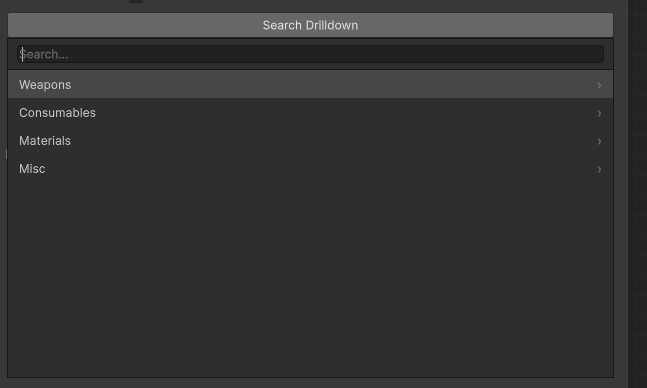
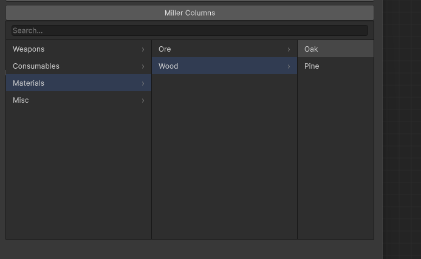
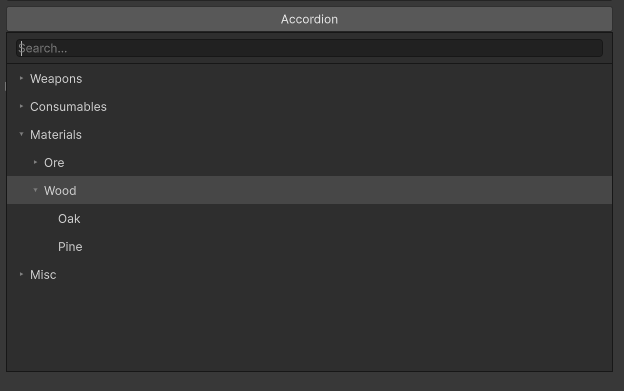
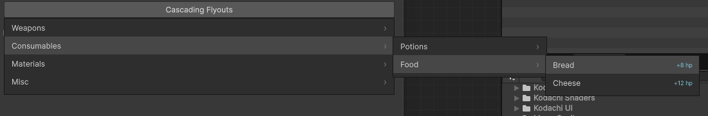

# Type Selector for Unity

Inspector attributes for flexible asset, type, component, and reference selection in Unity.

## Installation

Add via Package Manager → Add Package from disk, or copy to `Packages/TypeSelector-for-Unity/`.

## Features & API

### `[TypeSelector]` — Polymorphic Type Selection

Selects concrete implementations of a base class/interface with dropdown UI. Pair with `[SerializeReference]`.

```csharp
[SerializeReference, TypeSelector]
public ModifierBase modifier;
```

**Draw Modes:**
- `DrawMode.Default` — Foldout (collapsible)
- `DrawMode.NoFoldout` — Inline without foldout
- `DrawMode.Inline` — Compact

```csharp
[SerializeReference, TypeSelector(DrawMode.Inline)]
public EffectBase effect;
```

### `[SelectorName]` — Custom Dropdown Names

Rename types in selectors:

```csharp
[SelectorName("Modifier (2x Multiply)")]
public class MultiplyModifier : ModifierBase { }
```

Without this, class name is shown (namespace stripped automatically).

### `[HideInSelector]` — Hide a Class from the Dropdown

Excludes a class from `[TypeSelector]` dropdowns without making it an invalid `[SerializeReference]`
value. The type can still be assigned from code or loaded from an existing save — it is just not
offered as a choice in the picker.

```csharp
[HideInSelector]
public class LegacyModifier : ModifierBase { }
```

Pass `hideDerived: true` to also hide everything that derives from the type:

```csharp
[HideInSelector(hideDerived: true)]
public abstract class EditorOnlyEffectBase : EffectBase { }
```

Use it for intermediate base classes, deprecated implementations kept for save compatibility, or
editor-only / test scaffolding you don't want designers to pick. Your own tooling can query the same
rule via `SelectorVisibility.IsHidden(type)`.

### `[AssetSelector]` — Project Asset Search

Browse and select project assets with optional path filtering and grouping.

```csharp
[AssetSelector]
public ScriptableObject asset;

[AssetSelector(GroupMode.ByType, "Assets/Configs", "Assets/Data")]
public MyConfig config;
```

**GroupMode:**
- `None` — Flat list
- `ByPath` — Grouped by folder
- `ByType` — Grouped by asset type

### `[ComponentSelector]` — Component Picker

Select or create components on the same GameObject or a new child.

```csharp
[ComponentSelector]
public MyComponent component;

[ComponentSelector(AddMode.CreateChildGameObject, "Controller")]
public Controller controller;
```

### `[SubAssetSelector]` — Sub-Asset Selection

Pick sub-assets (e.g., sprites in atlases) from assets.

```csharp
[SubAssetSelector]
public Object subAsset;

[SubAssetSelector(ListMode.GroupedByType)]
public Sprite sprite;
```

### `[ScriptableObjectKey]` — Identity Tokens

Manage ScriptableObject references as identity keys with label + delete + dropdown UI.

```csharp
[ScriptableObjectKey]
public ScriptableObject key;
```

Useful for event systems, registries, or named configuration tokens.

### `[ShowEditor]` — Inline Editor UI

Display an inline property editor for complex fields.

```csharp
[ShowEditor]
public MyData data;
```

### `InterfaceReference<T>` — Polymorphic Interface Container

Generic wrapper allowing choice between Unity Objects (Component, ScriptableObject) or managed instances for interface types.

```csharp
[SerializeField]
public InterfaceReference<IController> controller;

// Use via implicit conversion
IController ctrl = controller; // Returns UnityEngine.Object OR managed instance
```

### `TagList<T>` — Typed ScriptableObject Lists

Base class for serialized lists of a specific ScriptableObject type.

```csharp
[Serializable]
public class ConfigTags : TagList<ConfigAsset> { }

[SerializeField]
public ConfigTags configs;
```

Implements `IList<T>` for runtime mutation.

## Common Patterns

**Polymorphic Gameplay:**
```csharp
[SerializeReference, TypeSelector(DrawMode.Default)]
public AbilityBase[] abilities;
```

**Asset Registry:**
```csharp
[AssetSelector(GroupMode.ByType)]
public ScriptableObject[] effects;
```

**Named Configuration Tokens:**
```csharp
[ScriptableObjectKey]
public ScriptableObject difficultyLevel;
```

**Interface with Fallback:**
```csharp
public InterfaceReference<IInputHandler> input;
```

## Custom Dropdown (`AdvancedDropdownBuilder`)

A reusable, styled dropdown used by the selector drawers and available on its own. You feed it
slash-separated paths (which become a folder tree) and a callback, then `Show(...)` it anchored to a
UI Toolkit element.

```csharp
new AdvancedDropdownBuilder()
    .AddElements(new[]
    {
        ("Weapons/Melee/Sword", swordId),
        ("Weapons/Ranged/Bow",  bowId),
        ("Consumables/Potion",  potionId),
    }, out var values)
    .SetCallback(i => Pick(values[i]))
    .WithRenderMode(DropdownRenderMode.MillerColumns)   // optional; default is SearchDrilldown
    .ShowTitle()                                        // optional; title bar is hidden by default
    .Build()
    .Show(button.worldBound);
```

Optional: `SetCreateOption(...)` adds a "＋ Create" row while searching, `SetItemContextHandler(...)`
enables right-click on leaves, `WithTitle(...)` sets the title text (shown only with `ShowTitle()`).

### Render modes

The same tree can be shown four ways via `WithRenderMode(DropdownRenderMode.*)`.

> **Where this applies:** `[TypeSelector]` and `[AssetSelector]` accept the render mode directly (see
> below). `[ComponentSelector]`, `[SubAssetSelector]`, and `[ScriptableObjectKey]` use their own
> dedicated windows rather than the shared `AdvancedDropdownBuilder`, so they always render in their
> own style and don't take a mode. You can also pick a mode for any dropdown you build yourself via
> `WithRenderMode(...)` or `Show(rect, mode)`.

```csharp
[SerializeReference, TypeSelector(renderMode: DropdownRenderMode.MillerColumns)]
public AbilityBase ability;

[AssetSelector(DropdownRenderMode.Accordion, GroupMode.ByType)]
public ScriptableObject config;
```

#### SearchDrilldown (default)

Search box filters the whole tree; click a folder to drill in one level, the back arrow (or `←`) to
ascend. Best for large sets where you roughly know the name.



#### MillerColumns

Picking a folder opens its children as a new column to the right while ancestors stay visible, so you
can compare siblings and see where you are. The search box flattens to a single results column. Best
for browsing a hierarchy.



#### Accordion

One vertical scroll of the tree; folders expand in place (▸/▾) with indentation. Searching
auto-expands the branches that contain matches and dims the rest. Best for scanning several branches
at once without navigating away.



#### CascadingFlyouts

Hovering a folder opens its submenu as a floating panel to the side, chaining down the path like a
native context menu — fast for sweeping the mouse down a known path. The root panel also has a search
box that filters to a flattened results list in place; clearing it restores the chain.



### Keyboard

Consistent across all modes, with two focus zones:

- **In the search field:** `↓` moves into the list (past the preselected first row); `↑` is ignored;
  `←`/`→` edit the search text; `Enter` activates the selection; typing filters.
- **In the list:** `↑`/`↓` move; `Home`/`End` jump to the first/last item; `→`/`Enter` descend into a
  folder (`Enter` also selects a leaf); `←`/`Backspace` go back; any printable key jumps back to the
  search field and filters.
- `Esc` closes. In CascadingFlyouts the search box lives on the root panel; child panels are
  browse-only.

Try all four live via **Tools → SelectorAttributes → Dropdown Render Mode Tester**.

## Notes

- `[TypeSelector]` requires `[SerializeReference]`; automatic filtering excludes abstracts, Unity Objects, and `[HideInSelector]` types
- `[AssetSelector]` searches by type; optional folder constraints
- All attributes work in arrays and lists
- Missing references are auto-cleaned on save

